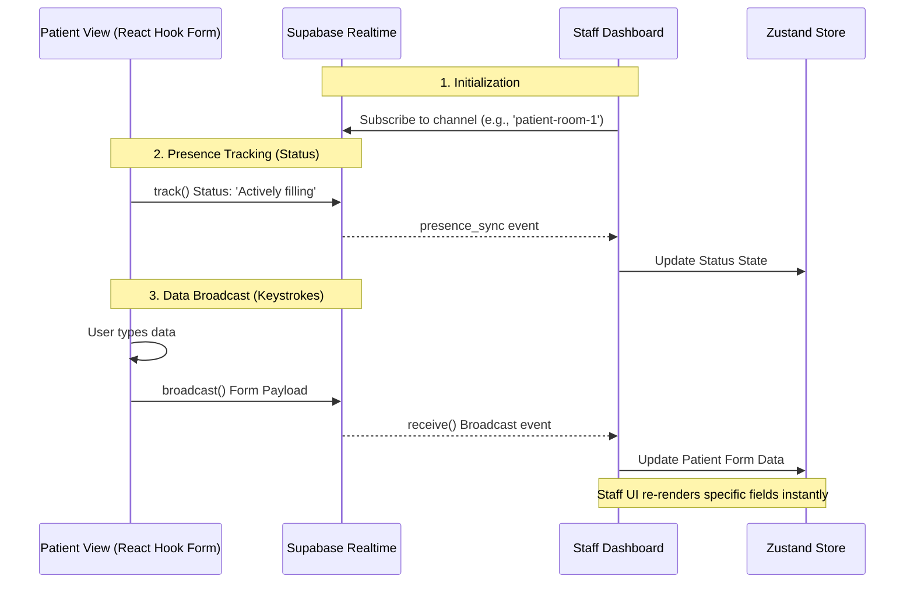

# Agnos Candidate Assignment - Development Planning

## 1. Technology Stack Selection
Based on the requirements for a responsive, real-time patient input form and staff view system, the following stack has been chosen to optimize for performance, maintainability, and modern development practices:

- **Framework:** Next.js (App Router) - Provides optimized rendering and a robust routing system.
- **Real-Time Communication:** Supabase (Realtime Broadcast & Presence) - Chosen to eliminate the need for a custom Node.js/Socket.IO backend, allowing direct client-to-client data synchronization with low latency.
- **Form Handling & Validation:** React Hook Form + Zod - Ensures high performance by minimizing re-renders during keystrokes (crucial for real-time broadcasting) and provides strict, type-safe validation.
- **UI & Styling:** Tailwind CSS + shadcn/ui - Allows for rapid, accessible, and highly responsive UI development without sacrificing design quality.
- **State Management:** Zustand - A lightweight global state manager used in the Staff View to handle rapid incoming real-time data efficiently.
- **Hosting:** Vercel - For seamless deployment and CI/CD.

## 2. Project Structure
The project will follow a clean and modular structure within the `src/` directory using the Next.js App Router paradigm:

```text
src/
├── app/                  # Next.js App Router pages
│   ├── patient/          # Route: /patient (Patient Form View)
│   │   └── page.tsx      
│   ├── staff/            # Route: /staff (Staff Dashboard View)
│   │   └── page.tsx      
│   ├── layout.tsx        # Global layout
│   └── page.tsx          # Landing page / Navigation
├── components/           # Reusable UI and Domain components
│   ├── ui/               # shadcn/ui generic components (Button, Input, Card)
│   ├── patient/          # Patient domain components (PatientForm, etc.)
│   └── staff/            # Staff domain components (StaffDashboard, StatusIndicator, etc.)
├── lib/                  # Utilities and configurations
│   ├── supabase.ts       # Supabase client initialization
│   ├── schemas.ts        # Zod validation schemas (shared between form and types)
│   └── utils.ts          # Helper functions (e.g., Tailwind class merger)
└── store/                # Global State
    └── useStaffStore.ts  # Zustand store for managing incoming real-time data
```

## 3. Design (UI/UX) & Advanced Healthcare Features
Based on UX research for healthcare applications, the design prioritizes accessibility, cognitive ease for all ages, and efficiency for medical staff.

**A. Patient View (Mobile-First & Low Cognitive Load):**
- **Wizard/Stepper Layout:** The form is divided into logical steps (1. Personal -> 2. Contact -> 3. Emergency) to reduce cognitive overload, a proven best practice for elderly users.
- **Accessible Inputs & Touch Targets:** Utilizing large touch targets (min 44x44px). Employing visual selectors (Radio Buttons, Toggle Groups) instead of tiny dropdowns to aid users with reduced motor skills.
- **Input Masking (Auto-formatting):** Implementing auto-formatters for fields like Phone Numbers (e.g., `081-XXX-XXXX`) and Dates to reduce typing effort and format errors.
- **Auto-Save Draft (State Persistence):** Utilizing `localStorage` to save the form state locally. If a patient accidentally closes the browser, their progress is recovered upon reopening.
- **Smart Validation UX:** Errors will be validated `onBlur` (when leaving a field) rather than `onChange` to prevent aggressive, premature error messages while the patient is still typing.

**B. Staff View (Desktop-Optimized Dashboard):**
- **Information Density & Grouping:** A Card-based Grid layout groups data identically to the patient's steps, allowing staff to scan information rapidly.
- **Iconography:** Utilizing universally understood medical and contact icons (🚨, 📱, 🩸) to speed up visual processing.
- **Empty States & Skeleton Loaders:** Providing a clean "Waiting for patient connection..." empty state, and using Skeleton UI during initial data fetches to reduce perceived loading times.
- **Subtle Real-time Indicators:** Connection status (Online, Typing, Submitted) uses distinct color badges (Green/Gray) placed strategically to avoid layout shifts (Cumulative Layout Shift - CLS) when the status toggles.
- **Dark Mode Support:** Essential for hospital staff working night shifts to reduce eye strain.

**C. Typography & Color Palette:**
- **Agnos Brand Identity (Colors):** Instead of a generic medical theme, the UI will specifically adopt the **Agnos brand color palette** (extracting the primary blue from the Agnos logo) to create a tailored, production-ready feel. This naturally aligns with health-tech color psychology (trust, cleanliness, safety).
- **Contrast & Accessibility:** The brand colors will be adjusted where necessary to maintain a minimum 4.5:1 contrast ratio against the background (adhering to WCAG guidelines).
- **Typography:** Minimum 16px clean, modern sans-serif font (e.g., Inter or Roboto) for high readability across all demographics.

## 4. Component Architecture
- **`PatientForm` (Client Component):**
  - Handles user inputs utilizing `useForm` from React Hook Form.
  - Uses `watch()` to capture keystrokes and broadcasts the payload to Supabase.
- **`StaffDashboard` (Client Component):**
  - The main container for the staff view. Initializes the Supabase channel subscription on mount.
  - Dispatches incoming real-time data to the Zustand store.
- **`useStaffStore` (Zustand):**
  - Separates data logic from UI. Holds the current state of the patient's form and their connection presence, preventing unnecessary full-page re-renders.
- **`StatusIndicator`:**
  - A small, reusable component reflecting the Supabase Presence state (e.g., a green dot for 'Actively filling', gray for 'Inactive').

## 5. Real-Time Synchronization Flow

To clearly illustrate the event-driven architecture and how client-to-client data sync is achieved without database overhead, here is the sequence of events:



1. **Connection Initialization:** When a patient opens the form, a Supabase Realtime Channel is created (e.g., `patient-room`). The Staff View subscribes to this exact channel.
2. **Presence Tracking (Status):** The patient's client uses Supabase `track()` to broadcast their status. If they focus on an input or type, the status changes to "Actively filling". If idle for a set time, it changes to "Inactive". The staff view listens to `presence_sync` to update visual indicators.
3. **Data Broadcasting (Sync):** 
   - As the patient types, React Hook Form captures the current data.
   - The data payload is sent through the Supabase channel using the `broadcast` method.
   - *Architecture benefit:* This bypasses the PostgreSQL database entirely, ensuring ultra-low latency client-to-client communication.
4. **State Update:** The Staff View receives the broadcast event, updates the Zustand `useStaffStore`, and the React UI re-renders only the specific fields instantly to match the patient's screen.
